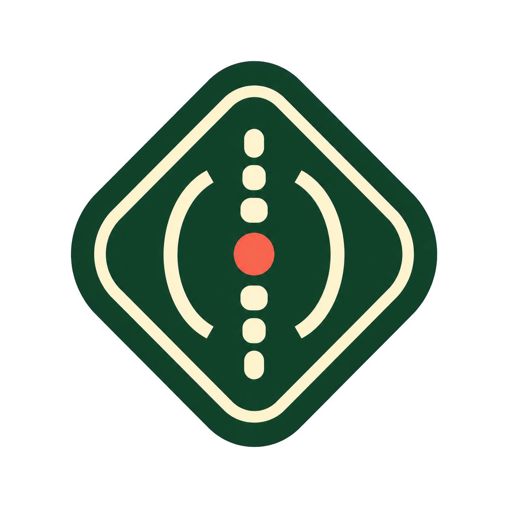

# Pose Nudge
<p align="center">
  <!-- 프로젝트 로고를 여기에 추가할 수 있습니다. -->
  
  <br>
  <strong>AI 기반 자세 교정 도우미 - 실시간 자세 분석 및 개선 가이드</strong>
</p>

<p align="center">
  <!-- 소셜 및 커뮤니티 배지 -->
  <a href="https://github.com/dduldduck/pose-nudge/stargazers"></a>
  <a href="https://github.com/dduldduck/pose-nudge/network/members"></a>
  <a href="https://github.com/dduldduck/pose-nudge/graphs/contributors"></a>
  <br>
  <!-- 상태 및 릴리즈 배지 -->
  <a href="https://github.com/dduldduck/pose-nudge/releases"></a>
  <a href="https://github.com/dduldduck/pose-nudge/releases"></a>
  <a href="LICENSE"></a>
  <br>
  <!-- 개발 활동 배지 -->
  <a href="https://github.com/dduldduck/pose-nudge/actions/workflows/release.yml"></a>
  <a href="https://github.com/dduldduck/pose-nudge/issues"></a>
  <a href="https://github.com/dduldduck/pose-nudge/pulls"></a>
</p>

<p align="center">
  <a href="./README.md"></a>
  <a href="./README.ko.md"></a>
  <a href="./README.tr.md"></a>
</p>

---

## ✨ Key Features

Pose Nudge는 웹캠을 활용하여 실시간으로 자세를 분석하고, 거북목과 같이 자세가 흐트러졌을 때 알림을 보내 바른 자세를 유도하는 강력한 데스크톱 애플리케이션입니다.

*   **📹 실시간 자세 분석**: 웹캠을 통한 실시간 자세 모니터링 및 AI 기반 분석
*   **🦴 거북목 감지**: 목과 어깨 선의 각도를 계산하여 거북목 상태 감지
*   **🔔 스마트 알림**: 자세 문제 감지 시 브라우저 알림 및 개선 권장사항 제공
*   **📊 자세 점수**: 0-100점으로 현재 자세 상태를 점수화하여 표시
*   **📈 통계 대시보드**: 자세 개선 진행상황 및 세션 기록 확인
*   **⚙️ 개인화 설정**: 알림 간격, 민감도, 분석 주기 등 사용자 맞춤 설정

---

## 🎥 데모

### 스크린샷

<!-- 스크린샷을 여기에 추가하세요 -->
<p align="center">
  

  
  
  
</p>

### 데모 GIF

<!-- 데모 GIF를 여기에 추가하세요 -->
<p align="center">
  
</p>

---

## 📥 Download

최신 버전의 Pose Nudge를 운영체제에 맞게 다운로드하세요.

| Operating System | File Format | Download Link |
| :---: | :---: | :---: |
| 💻 **Windows** | `.exe` | <a href="https://github.com/dduldduck/pose-nudge/releases/latest"></a> |
| 🍏 **macOS** | `.dmg` | <a href="https://github.com/dduldduck/pose-nudge/releases/latest"></a> |
| 🐧 **Linux** | `.AppImage` | <a href="https://github.com/dduldduck/pose-nudge/releases/latest"></a> |

---

## 👨‍💻 For Developers

기여에 관심이 있으시면 이 가이드를 따라 프로젝트를 로컬에서 설정하세요.

### Prerequisites

- [Node.js](https://nodejs.org/) (v18 or higher)
- [Rust](https://www.rust-lang.org/) (v1.70.0 or higher)
- [Git](https://git-scm.com/)

### Installation & Run

```bash
# 1. Clone the project
git clone https://github.com/dduldduck/pose-nudge.git
cd pose-nudge

# 2. Install Node.js dependencies
npm install

# 3. Run in development mode
npm run tauri dev
```

### Project Structure
```
pose-nudge/
├── src/                    # React 프론트엔드
│   ├── components/         # UI 컴포넌트
│   │   ├── ui/            # shadcn/ui 컴포넌트
│   │   ├── Dashboard.tsx   # 대시보드
│   │   ├── WebcamCapture.tsx # 웹캠 컴포넌트
│   │   └── SettingsPage.tsx # 설정 페이지
│   ├── lib/               # 유틸리티 함수
│   ├── locales/           # 다국어 지원
│   └── App.tsx            # 메인 앱 컴포넌트
├── src-tauri/             # Rust 백엔드
│   ├── src/
│   │   ├── main.rs        # 메인 백엔드 로직
│   │   ├── pose_analysis.rs # 자세 분석 엔진
│   │   └── notifications.rs # 알림 시스템
│   ├── Cargo.toml         # Rust 의존성
│   └── tauri.conf.json    # Tauri 설정
├── models/                # AI 모델 파일
├── public/                # 정적 파일
└── locales/               # 다국어 파일
```

---

## 🛠️ Tech Stack

-   **Framework**: Tauri (Rust + React)
-   **Frontend**: React 19, TypeScript, Tailwind CSS 4
-   **Backend**: Rust, Tauri 2
-   **AI/ML**: YOLO-Pose 모델 (향후 통합 예정)
-   **Build/Deployment**: Tauri CLI

---

## 🤝 Contributing

기여는 언제나 환영합니다! 버그 리포트, 기능 제안, 또는 코드 기여 등 어떤 형태든 환영합니다. 자세한 내용은 [Contributing Guidelines](CONTRIBUTING.md)를 확인하세요.

---

## ✨ Contributors

이 프로젝트를 더 좋게 만들어주신 훌륭한 분들께 감사드립니다! ([emoji key](https://allcontributors.org/docs/en/emoji-key))

<!-- ALL-CONTRIBUTORS-LIST:START - Do not remove or modify this section -->
<!-- prettier-ignore-start -->
<!-- markdownlint-disable -->
<table>
  <tbody>
    <tr>
      <td align="center" valign="top" width="14.28%"><a href="https://github.com/DDULDDUCK"><br /><sub><b>Jaeseok Song</b></sub></a><br /><a href="https://github.com/dduldduk/pose-nodge/commits?author=DDULDDUCK" title="Code">💻</a> <a href="#maintenance-DDULDDUCK" title="Maintenance">🚧</a></td>
    </tr>
  </tbody>
  <tfoot>
    <tr>
      <td align="center" valign="top" width="14.28%"><a href="https://github.com/DDULDDUCK"><br /><sub><b>Jaeseok Song</b></sub></a><br /><a href="https://github.com/DDULDDUCK/pose-nudge/commits?author=DDULDDUCK" title="Code">💻</a> <a href="#maintenance-DDULDDUCK" title="Maintenance">🚧</a></td>
      <td align="center" valign="top" width="14.28%"><a href="https://adamdangoor.com"><br /><sub><b>Adam Dangoor</b></sub></a><br /><a href="https://github.com/DDULDDUCK/pose-nudge/issues?q=author%3Aadamtheturtle" title="Bug reports">🐛</a></td>
      <td align="center" valign="top" width="14.28%"><a href="https://github.com/Yodoma"><br /><sub><b>Yodoma</b></sub></a><br /><a href="https://github.com/DDULDDUCK/pose-nudge/issues?q=author%3AYodoma" title="Bug reports">🐛</a></td>
      <td align="center" valign="top" width="14.28%"><a href="https://yusufyorunc.com.tr"><br /><sub><b>Yusuf Yorunç</b></sub></a><br /><a href="#translation-yusufyorunc" title="Translation">🌍</a></td>
    </tr>
  </tfoot>
</table>

<!-- markdownlint-restore -->
<!-- prettier-ignore-end -->

<!-- ALL-CONTRIBUTORS-LIST:END -->

---

## 📜 License

이 프로젝트는 [AGPLv3 License](LICENSE) 하에 배포됩니다.

## Contributors ✨

Thanks goes to these wonderful people ([emoji key](https://allcontributors.org/docs/en/emoji-key)):

<!-- ALL-CONTRIBUTORS-LIST:START - Do not remove or modify this section -->
<!-- prettier-ignore-start -->
<!-- markdownlint-disable -->
<!-- markdownlint-restore -->
<!-- prettier-ignore-end -->
<!-- ALL-CONTRIBUTORS-LIST:END -->

This project follows the [all-contributors](https://github.com/all-contributors/all-contributors) specification. Contributions of any kind welcome!
